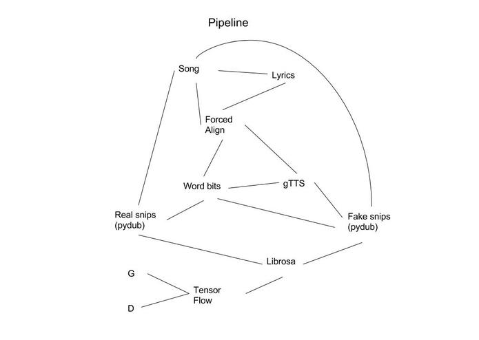
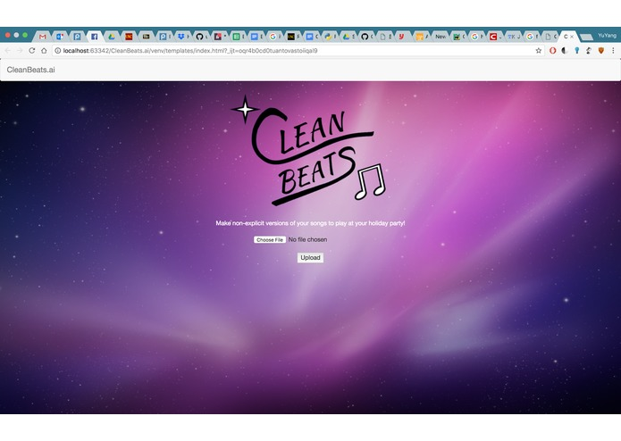

# CleanBeats.ai
Clean Beats is a github repo that, given an audio file and a transcript
will automatically dub out all the explitives in the given audio file
and return said file for download.

However, we finished that functionality the first night of the hackathon. Then,
we decided, what if we were able to, instead of dubbing out the word, replace the
word with any other word: essentially creating a "find and replace" program for
audio files. 

However, we were primarily using songs as our test files: imagine
jamming Siri's voice into the middle of an Eminem Song. It wouldn't work.

So our challenge for the rest of the weekend was essentially to build a model
that could automatically run style transfer on audio files seeded with a text to
speech generated audio and the context surrounding the word. 
In the proccess, we build a data pipeline so that every time somebody uses
our "Clean Beats" website functionality, we build up our dataset for our 
style transfer/generator network. 

  
   
  Our Data Pipeline

# Long Term Applications

At this point, the sun was starting to rise, and we were almost out of time.
We were able to train a generator that demonstrated our proof of concept that
our generator was able to learn the content to some extent. 

We hope to improve the performance of our generator/style transfer network
to allow replacement audio to be almost indistinguishable from its context.
Applications of our generator could include live stream audio replacement or
post production editing of long audio files

  
   
  Our Homepage

**Dependencies**

1. Python 2
2. Pydub - `pip install pydub`
3. Librosa - `pip install librosa`
4. Flask - `pip install flask`
5. Canetis - Instructions available at https://github.com/nsheth12/canetis

We had a great time building this! Shout out to the staff at SBHacks for hosting
a fantastic hackathon on a beautiful campus with delicious food!

